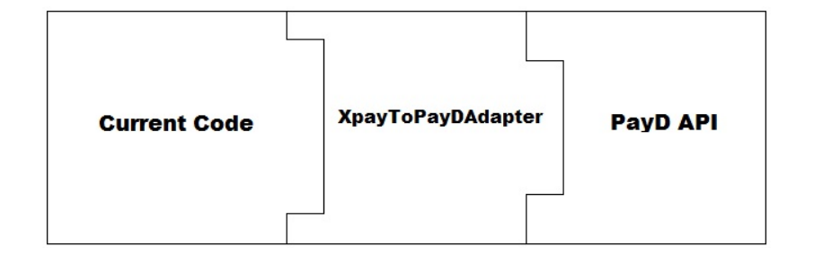

# Adapter Design Pattern
# Description
Le patron de conception Adapter permet de faire fonctionner ensemble des interfaces incompatibles. 

# Ce patron est particulièrement utile lorsque :

Interface Mismatch : Vous avez une classe existante, mais son interface ne correspond pas à celle dont vous avez besoin.
Coopération avec des Classes Non Liées : Vous souhaitez créer une classe réutilisable qui peut coopérer avec des classes non liées ou imprévues, 
c'est-à-dire des classes qui n'ont pas nécessairement des interfaces compatibles.
Adaptation d'Interfaces Multiples : Vous avez plusieurs sous-classes existantes et qu'il est peu pratique d'adapter leur interface en sous-classant chacune d'elles. 
Un adaptateur d'objet peut adapter l'interface de sa classe parente.

# Exemple :
A software developer, Max, has worked on an e-commerce website. The website allows users to shop and pay online. The site
is integrated with a 3rd party payment gateway, through which users can pay their bills using their credit card. Everything was
going well, until his manager called him for a change in the project.
The manager told him that they are planning to change the payment gateway vendor, and he has to implement that in the
code.
The problem that arises here is that the site is attached to the Xpay payment gateway which takes an Xpay type of object. The
new vendor, PayD, only allows the PayD type of objects to allow the process. Max doesn’t want to change the whole set of 100
of classes which have reference to an object of type XPay. This also raises the risk on the project, which is already running on the
production. Neither he can change the 3rd party tool of the payment gateway. The problem has occurred due to the incompatible
interfaces between the two different parts of the code. In order to get the process work, Max needs to find a way to make the
code compatible with the vendor’s provided API.
What Max needs here is an Adapter which can sit in between the code and the vendor’s API, and can allow the process to flow.
But before the solution, let us first see what an adapter is, and how it works.
Sometimes, there could be a scenario when two objects don’t fit together, as they should in-order to get the work done. This
situation could arise when we are trying to integrate a legacy code with a new code, or when changing a 3rd party API in the
code. This is due to incompatible interfaces of the two objects which do not fit together.
The Adapter pattern lets you to adapt what an object or a class exposes to what another object or class expects. It converts
the interface of a class into another interface the client expects. It lets classes work together that couldn’t otherwise because of
incompatible interfaces. It allows to fix the interface between the objects and the classes without modifying the objects and the
classes directly.

