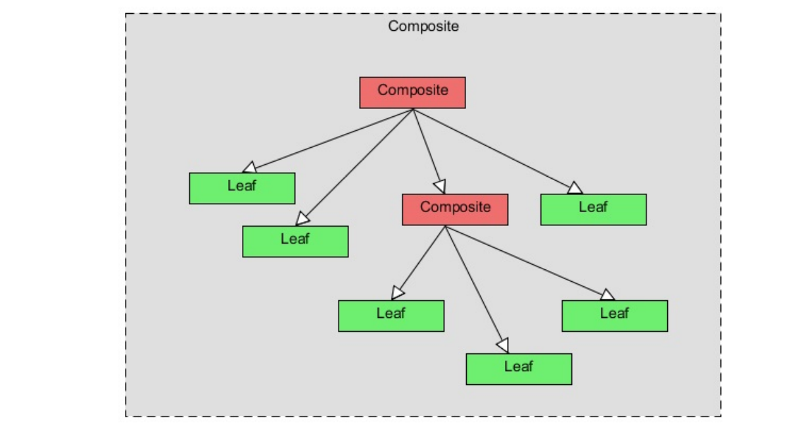

## What is the Composite Pattern
The formal definition of the Composite Pattern says that it allows you to compose objects into tree structures to represent partwhole hierarchies. Composite lets clients to treat individual objects and compositions of objects uniformly.
If you are familiar with a tree data structure, you will know a tree has parents and their children. There can be multiple children to
a parent, but only one parent per child. In Composite Pattern, elements with children are called as Nodes, and elements without
children are called as Leafs.
The Composite Pattern allows us to build structures of objects in the form of trees that contains both composition of objects and
individual objects as nodes. Using a composite structure, we can apply the same operations over both composites and individual
objects. In other words, in most cases we can ignore the differences between compositions of objects and individual objects.
The Composite Pattern has four participants:
• Component
• Leaf
• Composite
• Client

# diagram

# Use Case

