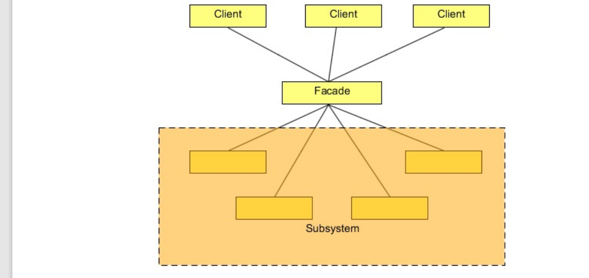

# Facade Pattern

The Facade Pattern makes a complex interface easier to use, using a Facade class. The Facade Pattern provides a unified interface
to a set of interface in a subsystem. Facade defines a higher-level interface that makes the subsystem easier to use.
The Facade unifies the complex low-level interfaces of a subsystem in-order to provide a simple way to access that interface. It
just provides a layer to the complex interfaces of the sub-system which makes it easier to use.

# Use Case
Your company is a product based company and it has launched a product in the market, named Schedule Server. It is a kind
of server in itself, and it is used to manage jobs. The jobs could be any kind of jobs like sending a list of emails, sms, reading
or writing files from a destination, or just simply transferring files from a source to the destination. The product is used by the
developers to manage such kind of jobs and able to concentrate more towards their business goal. The server executes each job
at their specified time and also manages all underline issues like concurrency issue and security by itself. As a developer, one
just need to code only the relevant business requirements and a good amount of API calls is provided to schedule a job according
to their needs.
Everything was going fine, until the clients started complaining about starting and stopping the process of the server. They said,
although the server is working great, the initializing and the shutting down processes are very complex and they want an easy
way to do that. The server has exposed a complex interface to the clients which looks a bit hectic to them.
We need to provide an easy way to start and stop the server.
A complex interface to the client is already considered as a fault in the design of the current system. But fortunately or unfortunately, we cannot start the designing and the coding from scratch. We need a way to resolve this problem and make the interface
easy to access.
To resolve this, we will create a facade class which will wrap a server object

# diagram

